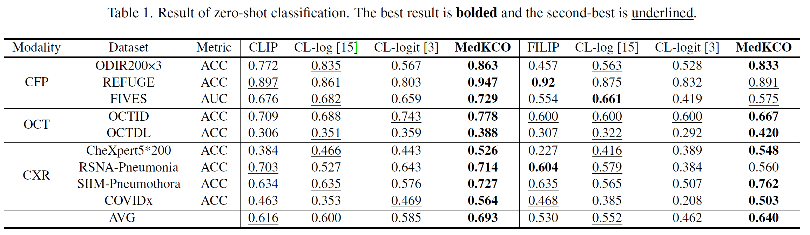
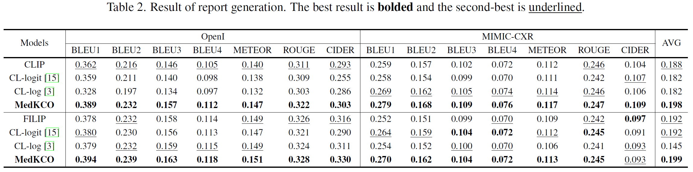
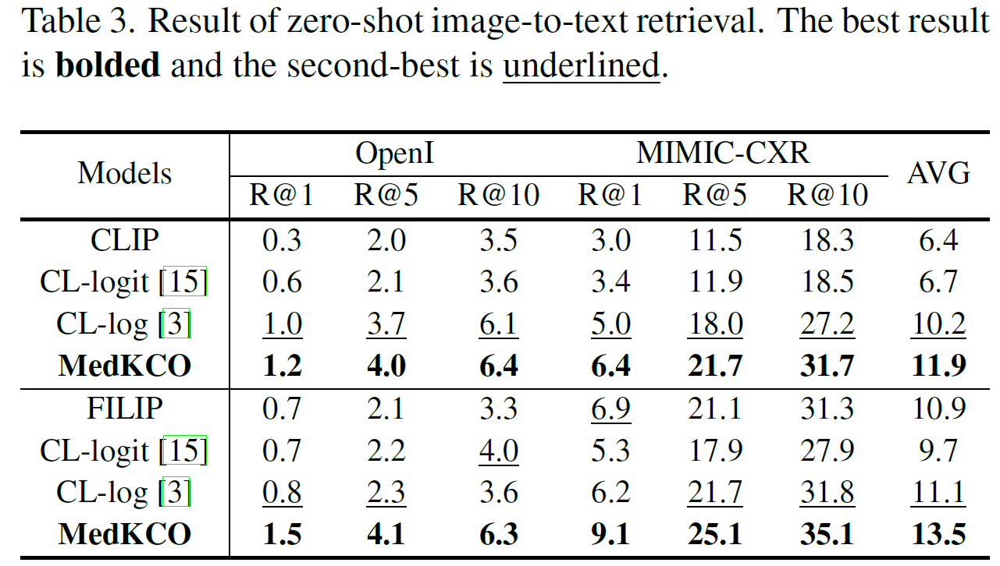
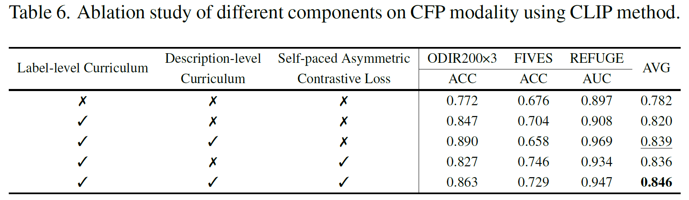

# MedKCO: Medical Vision-Language Pretraining via Knowledge-Driven Cognitive Orchestration

Paper [[CVPR](https://openaccess.thecvf.com/content/CVPR2026/papers/Zhang_MedKCO_Medical_Vision-Language_Pretraining_via_Knowledge-Driven_Cognitive_Orchestration_CVPR_2026_paper.pdf)\]&nbsp; &nbsp; Code[[Github](https://github.com/Mr-Talon/MedKCO)\]

by Chenran Zhang, Ruiqi Wu, Tao Zhou and Yi Zhou in **CVPR 2026**!

## :rainbow: Download Pre-training Datasets

* For label-level data of the CFP modalities, you can refer to **[FLAIR](https://github.com/jusiro/FLAIR)**.
* For description-level data of CFP and OCT modalities, you can refer to **[MM-Retinal v1](https://github.com/lxirich/MM-Retinal)** and **[RetiXfer](https://github.com/lxirich/RetiXfer)**.
* For label-level data of the OCT modalities, you can refer to the table below (coming soon):
* For CXR dataset **[MIMIC-CXR](https://physionet.org/content/mimic-cxr-jpg/2.1.0/)**, **[CheXpert](https://stanfordmlgroup.github.io/competitions/chexpert/)**

## :palm_tree: Quick Start
### 1. Environment
Clone the whole repository and install the dependencies.

- Python 3.8.19
- PyTorch 1.13.1
- cuda 12.2
- pandas 2.0.3
- numpy 1.24.3
- matplotlib 3.7.2
- transformers 4.44.1
- torchvision 0.14.1
- kornia 0.7.3
- scikit-learn 1.3.0

### 2. Training

* Prepare the pre-training dataset dataframes in `./local_data/prepare_partitions.py` (**already provided**).
* Define the relative paths for pre-training datasets 'PATH_DATASETS' and dataframes 'PATH_DATAFRAME_PRETRAIN' in `./local_data/constants.py`.
* Modify --modality, --datasets, --banned_categories, --out_path, --bert, --batch_size, --lr, --weight_decay in `main_pretrain.py`

```
python main_pretrain.py
```

You can use `text_img_rank.py` to generate dataframes for the description-level curriculum. You need to have already created the initial dataframes based on `./local_data/prepare_partitions.py` , and have a basic model weight for extracting features.

### 3. Evaluation

- Prepare the test dataset according to `./local_data/prepare_partitions.py`

- Download the model weights for CFP, FFA and CXR modalities and place them in `./results/pretraining`

- Modify the 'PATH_DATASETS' in `./local_data/constants.py`

- ```
  bash test.sh
  ```

## :telescope: Results

### 1. Zero-shot



### 2. Retrieval



### 3. Caption



### 4. Ablation Study 



## :dart: Checkpoints
|            Model             |Checkpoint|
|------------------------------|---------:|
| MedKCO_CFP     | [[Baidu Pan](https://pan.baidu.com/s/1sRhGppKYG1sawhCq_jmWfg?pwd=z1pn)\] |
| MedKCO_OCT | [[Baidu Pan](https://pan.baidu.com/s/1yEYERda31AI4XM0cJ-XfXQ?pwd=3i5k)\] |
| MedKCO_CXR | [[Baidu Pan](https://pan.baidu.com/s/1CgrY4nQOE7LLJqHgx44kEQ?pwd=asn2)\] |


## :cupid: Acknowledge
FLAIR -- https://github.com/jusiro/FLAIR

FFA-IR -- https://github.com/mlii0117/FFA-IR

MM-Retinal -- https://github.com/lxirich/MM-Retinal

## :mailbox_with_mail: Contact
If you have any question, please feel free to contact chenranzhang@seu.edu.cn.